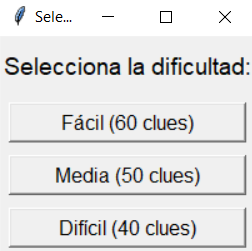
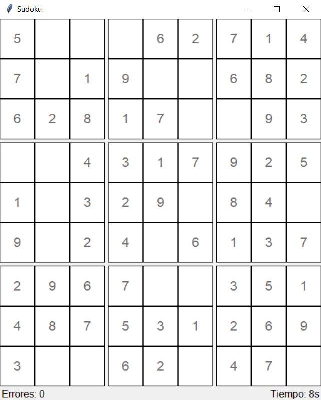

# Sudoku Game

Este es un proyecto de Sudoku desarrollado en Python con una interfaz gráfica basada en **Tkinter**. El juego permite seleccionar diferentes niveles de dificultad y ofrece una experiencia interactiva, con contador de errores y temporizador.

## Características

- **Tres niveles de dificultad**: Fácil (60 pistas), Medio (50 pistas) y Difícil (40 pistas).
- **Interfaz gráfica con Tkinter**: Los números se pueden introducir haciendo clic en una celda y luego presionando Enter.
- **Contador de errores**: Cada vez que el jugador se equivoca, el contador aumenta hasta un máximo de 3 errores, lo que termina el juego.
- **Temporizador**: El tiempo se muestra desde el inicio de la partida para medir el tiempo que tarda el jugador en resolver el Sudoku.
- **Validación de entradas**: Solo se aceptan números del 1 al 9 en cada celda.

## Requisitos

- Python 3.x
- Tkinter (viene preinstalado con Python en la mayoría de las distribuciones)

## Instrucciones de Instalación

1. Clona el repositorio:

   ```bash
   git clone https://github.com/antonioneco00/Sudoku.git
   ```

2. Navega al directorio del proyecto:

   ```bash
   cd nombre_del_repositorio
   ```

3. Ejecuta el archivo principal:

   ```bash
   python main.py
   ```

## Cómo Jugar

1. Selecciona la dificultad deseada al iniciar el juego.
2. Haz clic en una celda vacía y escribe un número del 1 al 9.
3. Presiona Enter para validar el número ingresado.
4. El juego terminará cuando completes el Sudoku o cuando cometas 3 errores.

## Capturas de Pantalla

### Menú de Selección de Dificultad


### Tablero de Sudoku


## Contribución

Las contribuciones son bienvenidas. Si deseas mejorar el juego o agregar nuevas características, puedes hacer un fork de este repositorio y enviar un pull request.
